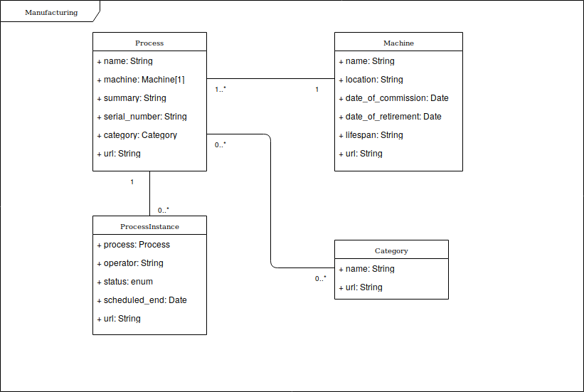
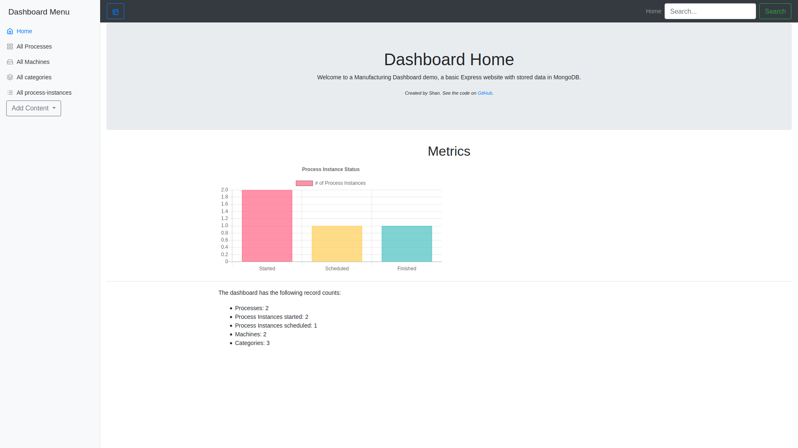
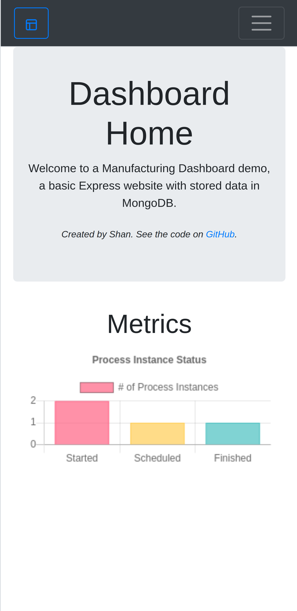
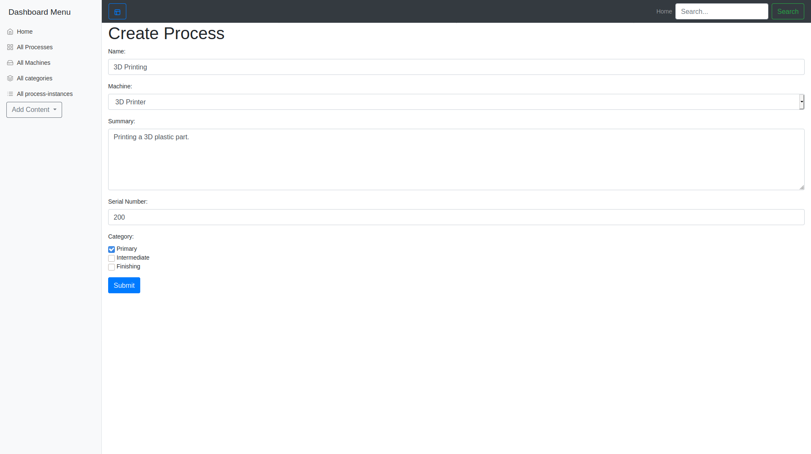
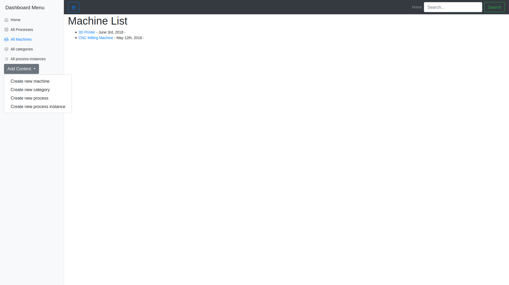
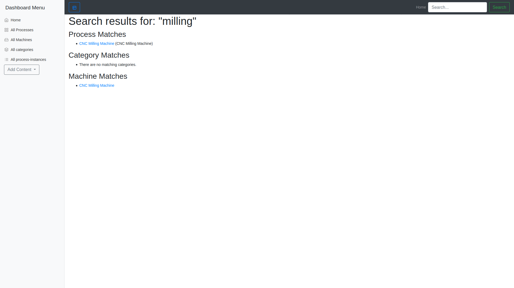

# Express Dashboard Demo

This is a basic Express website with stored data in MongoDB. It was developed to learn about dashboards creation, Node.js, Express and MongoDB. The example of a manufacturing plant was developed for demonstration purposes.

The model logic is developed as shown in this UML diagram.



## Getting Started

### Prerequisites

A Node.js installation with `npm`.

### Installing

Install locally with `npm`:

```
npm install
```

For development, run with `nodemon`:

```
npm run dev
```

## Deployment

Depending on the particular deployment environment, process environment variables may need to be set.

Verify the following for deployment:

```
process.env.MONGODB_URI
process.env.PORT
```

Depending on the MongoDB service and Mongoose driver support, the
`mongoose.connect(db, { params })` function parameters may need to be tweaked in `server.js`.

## Usage

The primary endpoints are defined in `app.js`. Implementation details are located in the folder `routes` with the associated filenames.

- ### Index: `/`

  - This endpoint handles the redirect to the main page path.

- ### Items: `/dashboard`

  - This endpoint handles serving the main page and realted dashboard views.

Some screenshots of the running app:

Main Page on Desktop:



Main Page on Mobile:



A typical form (Create a new process):



A dropdown to add content:



A very reudimentary search:



## Built With

- [Express.js](https://expressjs.com/) - A Node.js web application framework
- [Express-Validator](https://express-validator.github.io/docs/) - A set of validation middlewares for Express.js applications.
- [Mongoose](https://mongoosejs.com/) - MongoDB Object Document Mapper
- [(Express) Handlebars](https://handlebarsjs.com/) - A minimal views templating engine.
- [Helmet.js](https://helmetjs.github.io/) - Helmet helps you secure your Express apps by setting various HTTP headers.
- [Bootstrap (front-end library)](https://getbootstrap.com/) - Bootstrap is an open source toolkit for developing with HTML, CSS, and JS.

## License

This project is licensed under the MIT License - see the [LICENSE.md](LICENSE.md) file for details
